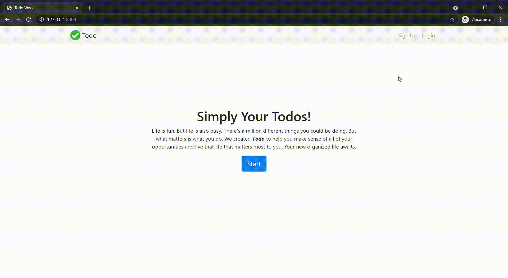

Todo site
=========

This is a multi-user Django project that implements Todo lists and repeats the example from the training course ["Django 3 - Full Stack Websites with Python Web Development"](https://www.udemy.com/course/django-3-make-websites-with-python-tutorial-beginner-learn-bootstrap/).

I am not a web designer and used templates from [the course repository](https://github.com/zappycode/django3-todowoo-project). Thanks, [Nick Walter](https://www.udemy.com/user/nicholaswalter2/)!

